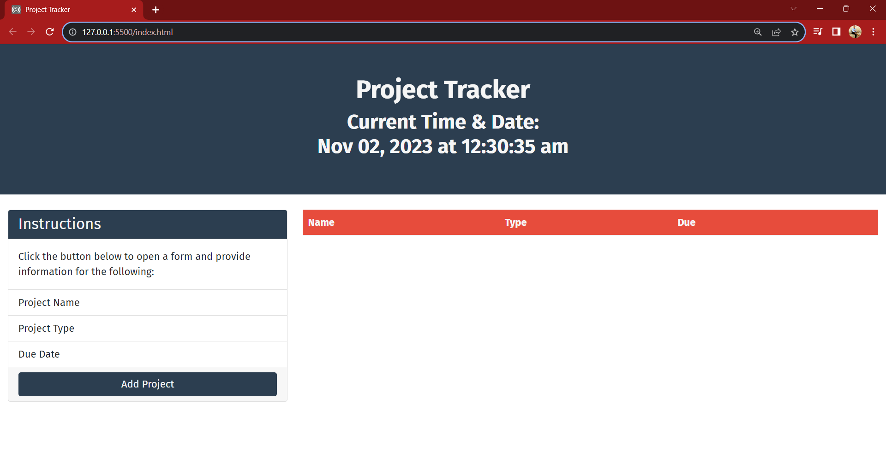

# Project Tracker

### Description
A Project Tracker App that will allow users to keep a list of projects in order to stay organized and their due dates so users wont miss any important dates!

- My motivation for this project was to further my skills and knowledge by creating another project that solves a problem in my personal life.
- I developed this app to make my life easier by listing school projects, work projects, self-teaching projects, and so on to know whats due, and what due dates are approaching in one place.
- From this project I learned how to use more of my resources when developing.

## This Project does the following
  - Displays the current time and date at the top of the page.
  - Allows users to add projects with the projects name, due date, and what type of project it is.
  - Fully Responsive

### Technologies Used
- HTML
- CSS
- Javascript
- Jquery
- Bootstrap

Deployed Site: https://batking74.github.io/Project-Tracker/

GitHub Repository: https://github.com/Batking74/Project-Tracker/edit/main/README.md
